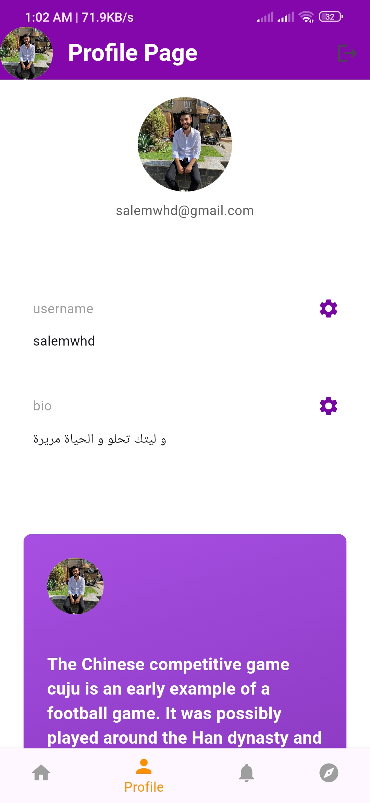
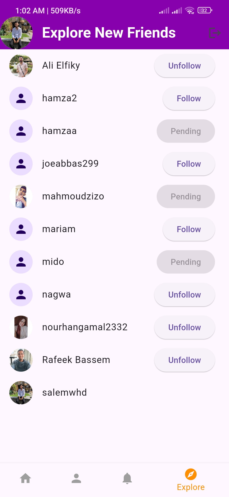

# Save Content

## Overview

**Save Content** is a social media application designed to allow users to post, share, like, and comment on content. It provides a platform for users to follow each other and ensures that users can save and protect their content, including text and images, by maintaining copyright rights.

## Features

- **User Registration and Authentication**: Users can create accounts, log in, and manage their profiles.
- **Posting**: Users can create posts with text and images.
- **Sharing**: Posts can be shared by users on their profiles.
- **Liking and Commenting**: Users can like and comment on posts.
- **Following**: Users can follow each other to see updates from people they are interested in.
- **Content Saving and Copyright**: Users can save their content and retain copyright rights, ensuring their work is protected.

## Technologies Used

- **Flutter**: Used for developing the mobile application for both Android and iOS.
- **Firebase**: Utilized for backend services including authentication, firestore database, and cloud storage.
- **Dart**: The programming language used in Flutter development.

## Installation

1. **Clone the repository**:
   ```bash
   git clone https://github.com/yourusername/save-content.git
   cd save-content

## Usage

  - Create an account: Sign up using your email and password.
  - Log in: Access your account with your credentials.
  - Create a post: Share your thoughts or images by creating a post.
  - Interact with posts: Like, comment, and share posts from other users.
  - Follow users: Follow other users to see their posts on your feed.
  - Save and protect your content: Ensure your posts are saved and copyright rights are maintained.

## Screeshots

<p align="center">
  
  
  
</p>

